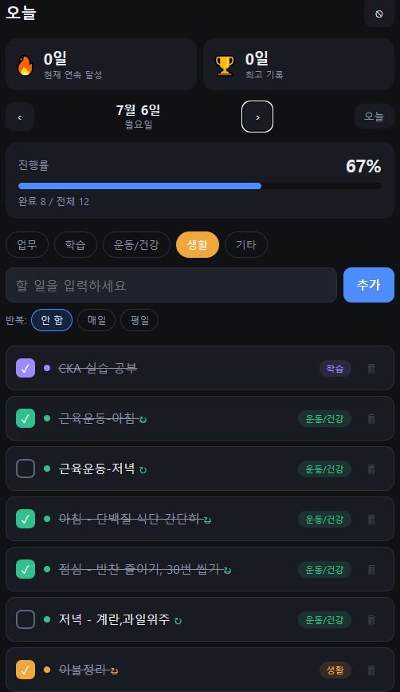
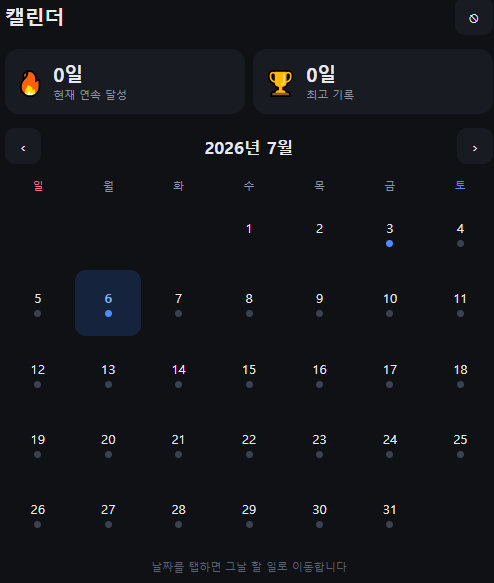
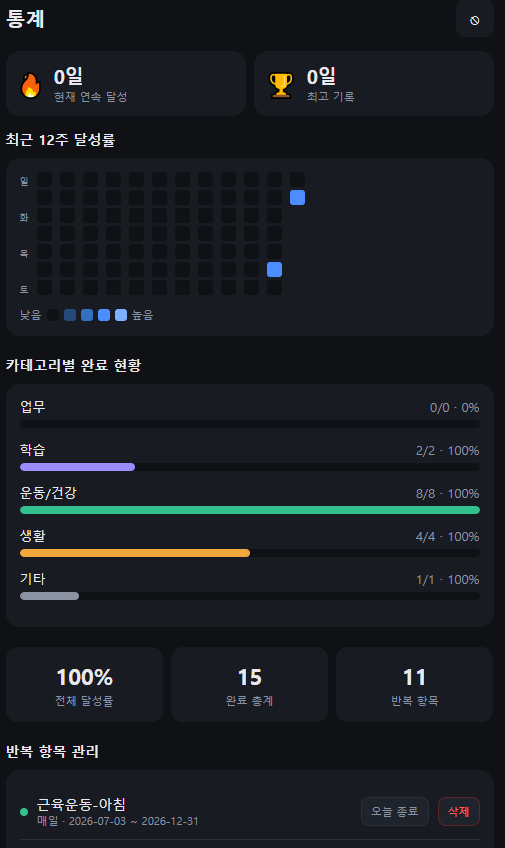

# 할 일 관리 PWA (Todo Mate 클론)

<p align="center">
  
  
  
</p>

카테고리·반복·통계 기반 개인 할 일 관리 앱. **서버리스 풀스택** 구조로, 백엔드 코드 없이 Supabase(Postgres) 직결 + PWA로 iOS 홈 화면 설치까지 지원한다.

배포: `https://moonlit-sunshine-d5b8e4.netlify.app`

---

## 아키텍처

```
┌─────────────┐     정적 서빙      ┌──────────────┐
│   Browser   │ ◄───────────────── │   Netlify    │  (CDN + HTTPS)
│  (PWA/iOS)  │                    └──────────────┘
│             │
│  index.html │     REST / Auth    ┌──────────────┐
│  (JS only)  │ ◄────────────────► │   Supabase   │
└─────────────┘   supabase-js v2   │  PostgreSQL  │
                                    │  + GoTrue    │  (Auth)
                                    │  + PostgREST │  (Auto REST API)
                                    │  + RLS       │  (Row-level 보안)
                                    └──────────────┘
```

프론트(Netlify)는 화면만 전달하고, 데이터·인증은 브라우저가 Supabase와 직접 통신한다. 별도 API 서버가 없다.

---

## 기술 스택

| 계층 | 기술 | 역할 |
|------|------|------|
| Frontend | Vanilla JS, PWA | UI, 상태관리, 오프라인 셸 |
| Hosting | Netlify | 정적 서빙, CDN, 자동 HTTPS |
| Database | Supabase (PostgreSQL) | 데이터 저장 |
| API | PostgREST | 테이블 자동 REST 화 |
| Auth | Supabase Auth (GoTrue) | 이메일 로그인 |
| Security | PostgreSQL RLS | 사용자별 데이터 격리 |

프레임워크·빌드 스텝 없음. 단일 `index.html`.

---

## 핵심 설계 포인트

### 1. RLS 기반 멀티테넌시
모든 테이블에 `user_id = auth.uid()` 정책을 걸어, 클라이언트가 publishable key를 그대로 노출해도 **본인 데이터만** 접근 가능하다. 백엔드 인가 로직을 DB 계층으로 내림.

```sql
create policy "own tasks" on public.tasks
  for all using (auth.uid() = user_id) with check (auth.uid() = user_id);
```

### 2. 반복 일정의 지연 생성(lazy materialization)
매일/평일 반복 항목을 날짜마다 row로 만들지 않고, `recurring` 규칙 + `recurring_state`(날짜별 완료/스킵)로 분리 저장. 저장 공간을 규칙 수준으로 압축하고, 화면 렌더 시점에 해당 날짜의 occurrence를 계산한다.

### 3. 인증 게이트 단일화
`getSession()`으로 초기 진입을 1회 판정하고, `onAuthStateChange`는 `_ready` 플래그로 초기 판정 이후의 로그인/로그아웃 이벤트만 반영한다. 세션 확인과 이벤트 콜백이 경쟁해 빈 화면이 뜨던 문제를 제거.

### 4. PWA
`display: standalone` + 인라인 manifest로 iOS Safari "홈 화면에 추가" 시 주소창 없는 전체화면 실행. 앱스토어·개발자 계정 없이 네이티브급 UX.

---

## 기능

- 카테고리 5종(업무/학습/운동·건강/생활/기타), 날짜별 관리
- 반복 일정: 매일 / 평일 + 종료일 지정
- 반복 관리: 오늘부로 종료, 전체 일괄 삭제, 개별 날짜 스킵
- 월간 캘린더(날짜별 달성 링), 탭 시 해당일 이동
- 연속 달성 스트릭(현재/최고 기록)
- 최근 12주 히트맵, 카테고리별 달성률 통계
- 멀티 디바이스 동기화(PC ↔ iOS)

---

## DB 스키마

| 테이블 | 용도 |
|--------|------|
| `tasks` | 단발성 할 일 |
| `recurring` | 반복 규칙(매일/평일 + 기간) |
| `recurring_state` | 반복의 날짜별 완료/스킵 상태 |

전체 DDL + RLS 정책은 [`schema.sql`](./schema.sql) 참조.

---

## 로컬/배포 세팅

1. Supabase 프로젝트 생성 → `schema.sql` 실행(SQL Editor)
2. `Project Settings > API`에서 Project URL, Publishable key 복사
3. `index.html` 상단 `SUPABASE_URL`, `SUPABASE_ANON_KEY` 교체
4. Netlify에 정적 배포(빌드 스텝 없음, publish dir = 루트)
5. iOS Safari 접속 → 공유 → 홈 화면에 추가

---

## 알려진 한계 / 개선 여지

| 항목 | 현재 | 개선 방향 |
|------|------|-----------|
| 동기화 | 앱 실행 시 1회 fetch | Supabase Realtime 구독 |
| 오프라인 쓰기 | 미지원 | IndexedDB 큐 + 온라인 복귀 동기화 |
| 통계 집계 | 클라이언트 전량 로드 | Postgres 뷰/RPC 서버 집계 |
| 백업 | 수동(Free 플랜) | export 스케줄링 or Pro 플랜 PITR |

---

## 보안 노트

`index.html`의 `sb_publishable_...`는 브라우저 노출을 전제한 **공개 가능 키**로, 실접근 통제는 RLS가 담당한다. `service_role`/secret key는 클라이언트에 포함하지 않는다.
